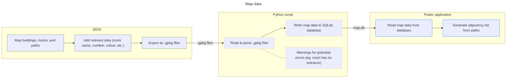

```mermaid
---
title: Map data
---
flowchart LR
    classDef qgis stroke:#589632;
    node1["Map buildings, rooms, and paths"]
    node2["Add relevant data (room name, number, colour, etc.)"]
    node3["Export as .gpkg files"]
    class node1,node2,node3 qgis

    subgraph QGIS
    node1 --> node2 --> node3
    end

    classDef python stroke:#FFE873;
    node4["Read & parse .gpkg files"]
    node5["Write map data to SQLite database"]
    warning["Warnings for potential errors (eg. room has no entrance)"]
    class node4,node5,warning python

    subgraph Python script
    node3 --".gpkg files"--> node4 --> node5
    node4 -.- warning
    end
    

    classDef flutter stroke:#027DFD;
    node6["Read map data from database"]
    node7["Generate adjacency list from paths"]
    class node6,node7 flutter

    subgraph Flutter application
    node5 --"map.db"--> node6 --> node7
    end
```