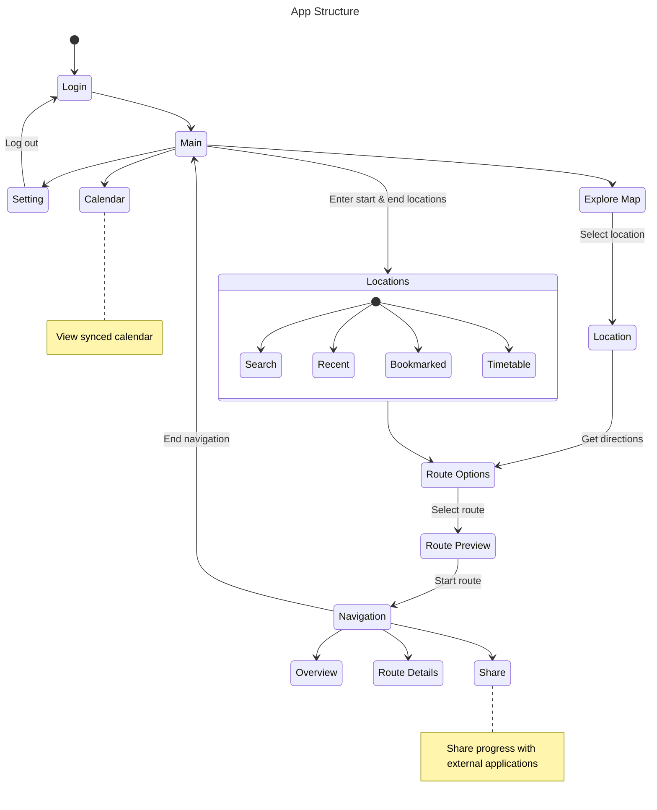

```mermaid
---
title: App Structure
---
stateDiagram-v2
    [*] --> Login
    Login --> Main 
    Main --> Setting
    Setting --> Login : Log out
    state Locations {
        [*] --> Search
        [*] --> Recent
        [*] --> Bookmarked
        [*] --> Timetable
    }
    Main --> Calendar
    note right of Calendar
        View synced calendar
    end note
    state "Explore Map" as em
    Main --> em
    em --> Location : Select location
    Location --> ro : Get directions
    Main --> Locations : Enter start & end locations
    state "Route Options" as ro
    Locations --> ro
    state "Route Preview" as rp
    ro --> rp : Select route
    rp --> Navigation : Start route
    Navigation --> Overview
    state "Route Details" as rd2
    Navigation --> rd2
    Navigation --> Share
    note right of Share
        Share progress with external applications
    end note
    Navigation --> Main : End navigation
```